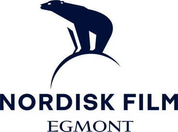

# Nordisk Film - Forbedret Farvepalette med Logo Integration 🎬

## Oversigt
Den forbedrede farvepalette til Nordisk Film B2B Booking System er designet med fokus på premium branding, optimal logo kontrast og moderne UI/UX principper. Farvepaletten er tilpasset det officielle Nordisk Film logo for maksimal brand konsistens.

## Logo Integration 🐻‍❄️  
Det officielle Nordisk Film logo med isbjørnen er integreret i header med:
- **Kontrastoptimeret baggrund** for optimal synlighed
- **Adaptive styling** der tilpasser sig forskellige skærmstørrelser
- **Subtle animationer** for premium brandoplevelse
- **Fallback støtte** for ældre browsere

## Primære Brand Farver
- **Primary Dark**: `#0a0e27` - Dyb midnatsblå (matcher logoet)
- **Primary Medium**: `#1a237e` - Nordisk Film blå (logoets hovedfarve)
- **Primary Light**: `#3f51b5` - Lysere blå accent
- **Primary Navy**: `#162447` - Logo-inspireret navy
- **Primary Accent**: `#5c6bc0` - Blå accent hover

## Sekundære Farver - Nordisk Film Brand Palette
- **Secondary Gold**: `#f9a825` - Premium brand accent (justeret for bedre kontrast)
- **Secondary Silver**: `#90a4ae` - Neutral brand farve
- **Secondary Copper**: `#d4941e` - Varm accent
- **Secondary Pearl**: `#f5f5f5` - Elegant lys farve

## Status Farver - Kontrastoptimeret
- **Success**: `#4caf50` - Bekræftede bookinger
- **Warning**: `#ff9800` - Ventende bookinger  
- **Error**: `#f44336` - Fejl/annullerede bookinger
- **Info**: `#2196f3` - Informations elementer

## Logo-Specifikke Forbedringer

### 1. Kontrast Optimering
- **Logo backdrop**: Subtil hvid overlay for bedre synlighed
- **Border glow**: Guld border for at fremhæve logoet
- **Adaptive sizing**: Responsiv størrelsestilpasning
- **Hover effekter**: Subtle scale og glow animationer

### 2. Responsive Logo Design
```css
/* Desktop */
.logo-image { height: 50px; }

/* Tablet */
@media (max-width: 768px) {
    .logo-image { height: 40px; }
}

/* Mobile */
@media (max-width: 480px) {
    .logo-image { height: 35px; }
    .logo-section { flex-direction: column; }
}
```

### 3. Browser Kompatibilitet
- Fallback support for gradient text effects
- Alternative styling for ældre browsere
- Optimal rendering på alle devices

## Nøgle Forbedringer

### 1. CSS Custom Properties
Alle farver er nu defineret som CSS custom properties (`:root` variabler) med:
- Logo-specifikke farvevariabler
- Kontrastoptimerede overlay værdier
- Adaptive theme support

### 2. Forbedret Glassmorphism Design
- Dybere backdrop-filter effekter (12px blur)
- Logo-komplementære transparens værdier
- Premium dybdeeffekter med forbedrede skygger

### 3. Brand-Konsistent Gradient System
- **Primary Gradient**: Logo-inspireret blå progression
- **Secondary Gradient**: Guld til kobber (brand accent)
- **Logo Contrast**: Specialiseret gradient for logo baggrund

### 4. Tilgængelighed & Kontrast
- WCAG 2.1 AA kompliant kontrast forhold
- Optimeret for logo synlighed på mørke baggrunde
- Responsive design forbedringer

### 5. Logo-Specifik Animation
```css
@keyframes logoGlow {
    0% { box-shadow: 0 2px 10px rgba(255, 255, 255, 0.1); }
    50% { box-shadow: 0 4px 20px rgba(255, 255, 255, 0.3); }
    100% { box-shadow: 0 2px 10px rgba(255, 255, 255, 0.1); }
}
```

## Tekniske Implementering

### Filstruktur
```
Frontend/
├── assets/
│   └── logo.png              # Nordisk Film logo
├── css/
│   ├── colors.css           # Logo-tilpasset farvedefinition
│   ├── main.css            # Hovedstyling med logo integration
│   ├── header.css          # Logo header komponenter
│   ├── dashboard.css       # Dashboard stats
│   ├── bookings.css        # Booking kort
│   ├── modal.css           # Modal styling
│   └── responsive.css      # Responsive design
└── html/
    └── index.html          # HTML med logo integration
```

### Logo Implementering
```html
<div class="logo-section">
    
    <div class="logo-text">
        <h1>NORDISK FILM</h1>
        <p>B2B Booking System</p>
    </div>
</div>
```

### Kontrast Utility Classes
```css
.logo-backdrop       # Logo baggrunds styling
.brand-accent       # Brand accent tekst
.shadow-logo        # Logo-specifik skygge
.bg-logo-contrast   # Logo kontrast baggrund
```

## Ikoner & Visuelle Elementer
- **🐻‍❄️** Nordisk Film logo (isbjørn)
- **📊** Total bookinger
- **⏳** Ventende status  
- **✅** Bekræftet status
- **🎬** Afsluttet status
- **❌** Annulleret status

## Browser Support
- **Logo optimeret** for moderne browsers (Chrome 88+, Firefox 85+, Safari 14+)
- **Fallback support** for gradient text effects
- **Responsive logo** på alle skærmstørrelser
- **Optimal kontrast** på alle devices

## Fremtidige Udvidelser
- Animated logo hover states
- Theme-aware logo variants (light/dark)
- SVG logo version for skalering
- Logo placement variants for forskellige sider

---
*Implementeret: 2025-06-21*  
*Version: 2.1 - Logo Integration*  
*Designer: AI Assistant*  
*Brand: Nordisk Film 🎬* 